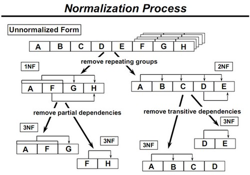

# Code 401 - Reading Class - 03

## nosql vs sql

**What type of database is the best fit for the complex query intensive environment?**

- SQL

**What type of database is the best fit for hierarchical data storage?**

- NoSQL

**Describe the differences in scalability between a SQl and NoSQL database as though you were speaking to a non-technical friend.**

- In most typical situations, SQL databases are vertically scalable. You can manage increasing load by increasing the CPU, RAM, SSD, etc, on a single server. On the other hand, NoSQL databases are horizontally scalable. You can just add few more servers easily in your NoSQL database infrastructure to handle the large traffic.

**How do we treat keywords and parameters differently in SQL syntax?**

- Keywords: Reserved words in SQL with predefined meanings.
- Parameters: Placeholders used to pass values dynamically into SQL statements.

**Define normalization within the context of schemas and data.**

**Explain the difference between one-to-one, one-to-many, and many-to-many relationships to a non-technical recruiter.**

- One to many is like the relationship between employees and the department each one of them working in, every single department has many employees.

- One to one is like the relationship between employees and the cars they drive. Each employee has one car, and each car belongs to one employee.

## sql modeling techniques

**Among data tables, what is a one-to-many relationship and how do we “relate” them?**

- To represent a one-to-many relationship in your database design, take the primary key on the "one" side of the relationship and add it as an additional field or fields to the table on the "many" side of the relationship.

**Prior to designing your relational database, it might be useful to ___ a ___ of the database tables and their relationships.**

- When working with SQL databases it is often useful to create a diagrams of the database tables and their relationships.

**Explain the difference between a primary and foreign key.**

- A primary is the key that identifies the whole row, the foreign key is a primary key for a table row existing in another table.
